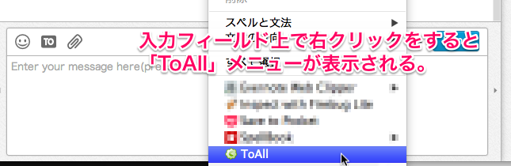

ToAllForChatwork
================

### 概要

Chatworkグループチャット時に全員宛先指定が出来るGoogleChromeExtensionです。  

### インストール
GoogleChomeで[WebStore](https://chrome.google.com/webstore?hl=ja)にアクセスをしてインストールします。  

### 使い方
1. [chatwork](https://chrome.google.com/webstore/detail/toallforchatwork/nngjnmkapdmamjdlndognkjjkneapcgc/details?hl=ja)にログインして、グループチャットに入室します。  
2. チャット入力テキストエリアで右クリックをすると「ToAll」メニューが表示されます。  
3. メニューを選択すると、チャットメンバー全員の宛先が補完されます。    
  
  

